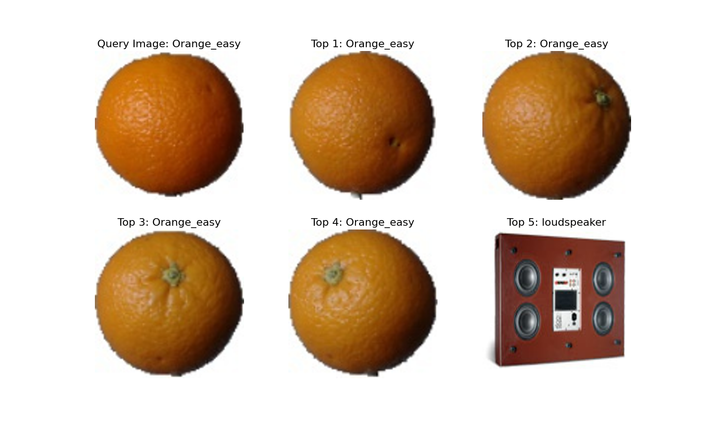
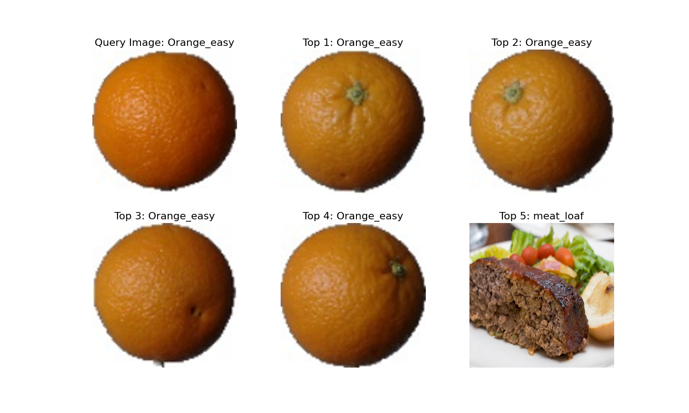
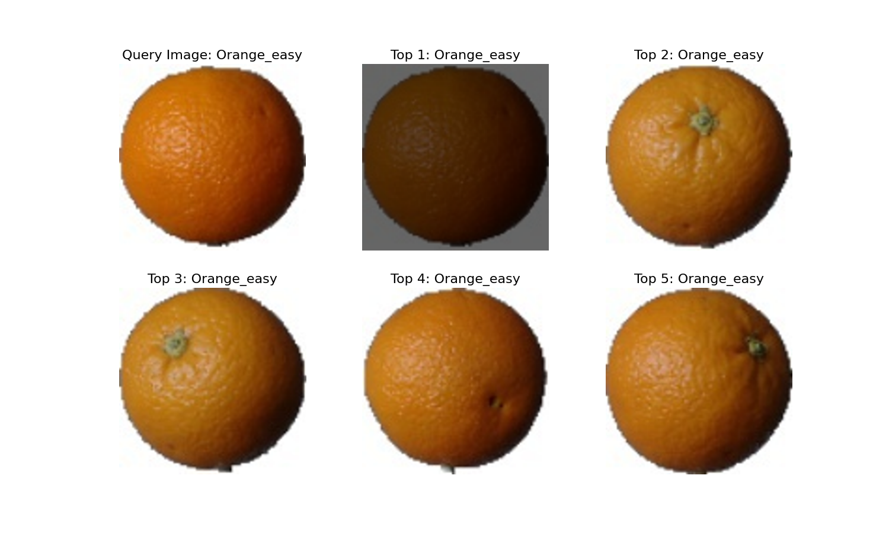
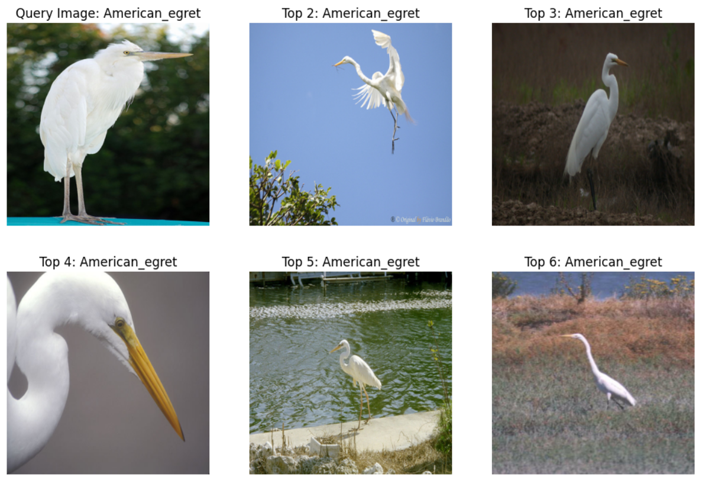

# Image Retrieval System

This project implements an image retrieval system using various techniques, from basic similarity measures to advanced deep learning approaches.

## Table of Contents
- [Introduction](#introduction)
- [Features](#features)
- [Project Structure](#project-structure)
- [Installation](#installation)
- [Usage](#usage)
- [Contributing](#contributing)

## Introduction

This image retrieval system offers implementations ranging from traditional similarity measures to state-of-the-art deep learning techniques. It aims to efficiently retrieve relevant images from a dataset based on a query image.

## Features

- Multiple similarity measures: L1, L2, Cosine Similarity, Correlation Coefficient
- Deep learning-based feature extraction using CLIP
- Vector database integration for efficient retrieval
- Jupyter notebooks for method comparisons
- Configurable data loading and result visualization

## Project Structure

```
IMAGE-RETRIEVAL/
├── github/
│   └── workflows/
│       └── build.yml
├── assets/
├── data/
├── notebooks/
│   ├── embedding_method.ipynb
│   ├── traditional_method.ipynb
│   └── vector_database_method.ipynb
├── source/
│   ├── __pycache__/
│   ├── config.py
│   ├── data_loader.py
│   ├── plot_results.py
│   ├── retrieval.py
│   └── similarity.py
├── .gitignore
├── LICENSE
├── README.md
├── main.py
├── requirements.txt
└── sonar-project.properties
```

## Installation

1. Clone the repository:
   ```
   git clone https://github.com/tiendat25052004/image-retrieval
   cd image-retrieval
   ```

2. Install dependencies:
   ```
   pip install -r requirements.txt
   ```

## Usage

1. Configure the system in `source/config.py`.
2. Run the main script:
   ```
   python main.py
   ```
   Examples:
- **L1 Distance**:

- **L2 Distance**:

- **Cosine Similarity**:

- **Correlation Coefficient**:

3. For advanced methods, refer to the Jupyter notebooks in the `notebooks/` directory.
   Examples:
- **Vector Database with Cosine Similarity**:

## Contributing

Contributions are welcome. Please fork the repository and submit a pull request with your changes.
